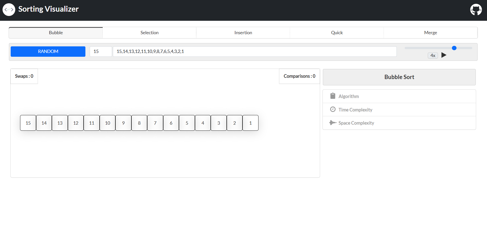

# Sorting Visualizer

Sorting Visualizer is a web application that visually demonstrates how different sorting algorithms work. Users can input their own arrays or generate random ones, select a sorting algorithm, and watch the sorting process step by step with visual feedback on swaps and comparisons.

## Features

- **Visualize Sorting Algorithms:** Bubble Sort, Selection Sort, Insertion Sort, Quick Sort, and Merge Sort.
- **Interactive Controls:** 
  - Choose sorting algorithm from the menu.
  - Input custom arrays or generate random arrays.
  - Adjust sorting speed.
  - View real-time swap and comparison counts.
- **Algorithm Information:** Each algorithm panel displays a description, pseudocode, and time/space complexity.

## Technologies Used

- **Frontend:** HTML, CSS, Bootstrap, Semantic UI, Fomantic UI, FontAwesome
- **JavaScript:** For DOM manipulation and sorting logic
- **jQuery:** For UI interactions

## Getting Started

1. **Clone the repository:**
   ```bash
   git clone https://github.com/sumit-s07/sorting-visualizer.git
   ```
2. **Navigate to the project directory:**
   ```bash
   cd sorting-visualizer
   ```
3. **Open `index.html` in your browser.**

No build steps or server required.

## Usage

- Select a sorting algorithm from the top menu.
- Enter the array size and/or custom input, or click **RANDOM** to generate an array.
- Adjust the speed slider as desired.
- Click the play icon to start sorting.
- Watch the visualization and track swaps/comparisons.

## Screenshots



## Credits

- Developed by [sumit-s07](https://github.com/sumit-s07)
- UI Libraries: [Bootstrap](https://getbootstrap.com/), [Semantic UI](https://semantic-ui.com/), [Fomantic UI](https://fomantic-ui.com/), [FontAwesome](https://fontawesome.com/)

## License

This project is licensed under the MIT License.

---